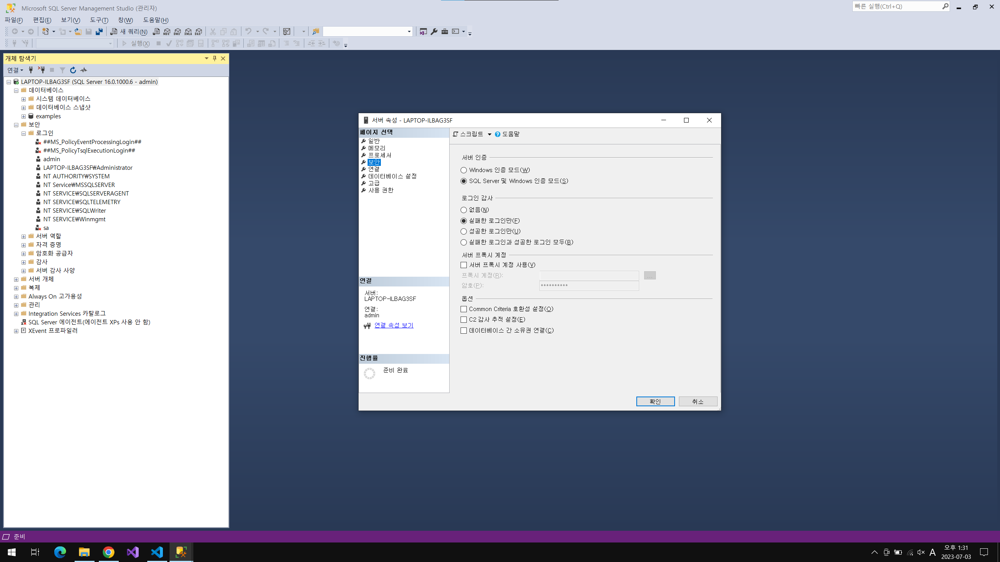
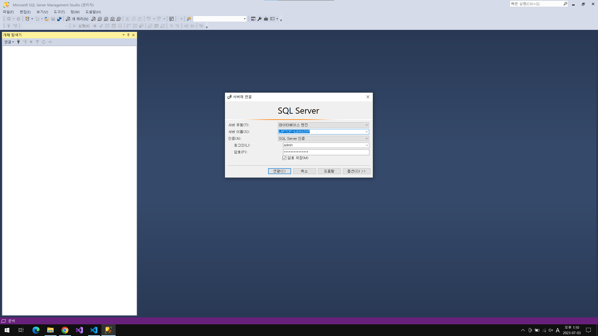

# Connect to the database

데이터베이스 연결하기 튜토리얼

## 개발환경 설정하기

**1단계:** npm 을 이용하여 express 모듈 설정하기

npm 을 이용하여 필수 모듈을 다운받아 개발환경을 설정 후 필요에 따라서 서브 모듈을 추가로 설치하여 사용하도록 한다.

```sh
# npm 프로젝트 생성
> npm init

# express 모듈 설치
> npm i express nodemon

# 서브 모듈 설치
> npm i nodemon dotenv cors mssql
```

**2단계:** 환경설정(.env) 파일을 이용하여 PORT 설정하기

```ini
# include .env file
PORT = "5000"
```

**3단계** Express Router 설정하기

_<참고> package.json `"type": "module"` 옵션을 추가하면 import 형식을 이용하여 모듈을 불러올 수 있다._

```js
import dotenv from "dotenv";
import express from "express";

dotenv.config();

const { PORT } = process.env;
const port = PORT || 4000;
const app = express();

app.listen(port, () => {
  console.log(`Listen on port ${port}`);
});
```

**4단계:** SQL Server 설치 및 로그인

MSSQL을 사용하기 위해 SQL Server 및 SSMS(SQL Server Manager Studio)를 설치해야 한다. 아래 링크를 이용하여 개발환경에 맞춰 프로그램을 설치하면 된다.

- [SQL Server](https://www.microsoft.com/ko-kr/sql-server/sql-server-downloads)
- [SSMS](https://learn.microsoft.com/ko-kr/sql/ssms/download-sql-server-management-studio-ssms?view=sql-server-ver16)

SSMS 프로그램을 실행하면 `데이터베이스 엔진` 유형으로 서버에 연결을 할 수 있다. 연결 후 `개체 탐색 > 데이터베이스 > 새 데이터베이스` 와 `개체 탐색 > 보안 > 새로 만들기 > 로그인`을 이용하여 서버에서 연결할 데이터베이스 및 사용자 아이디를 생성한다.

`개체 탐색 > 연결된 데이터베이스 우클릭 > 속성 > 보안 > 서버 인증`은 기본값으로 `Windows 인증 모드`로 선택되어 있다. 새로운 계정을 이용하여 로그인을 하기 위해서는 `SQL Server 및 Windows 인증 모드`를 선택해야 한다.



로그인 사용자 생성 시에는 `로그인 속성 > 일반 > 기본 데이터베이스` 및 `로그인 속성 > 사용자 매핑 > 이 로그인으로 매핑된 사용자`에 새롭게 생성한 데이터베이스를 설정해 주어야 한다. 그리고 사용자에 대한 권한을 추가 후 서비스를 재시작한다.



**5단계:** SQL Server 구성

`SQL Server 구성 관리자 > SQL Server 네트워크 구성 > MSSQLSERVER에 대한 프로토콜` 을 이용하여 TCP/IP 프로토콜을 사용할 수 있도 속성을 변경해야 한다.

- 프로토콜 속성 > 일반 > 사용 : 예
- IP주소 > IP4 > 사용 : 예 _(TCP 포트가 외부에서 접근할 Port 이다.)_

## 미들웨어 설정하기

### Query string & Request body

---

Express에서 qs(Query string) 및 json 형식의 Request Body를 파싱하기 위해서는 아래와 같은 형태로 미들웨어를 추가해 주어야 한다. (Express 4.16 이후 부터는 내장모듈 사용)

```js
import express from "express";

const app = express();

app.use(express.urlencoded({ extended: true })); // parsing query string
app.use(express.json()); // parsing request json

// ...
```

### CORS

---

브라우저에서 보안의 위해 cross-origin HTTP 요청을 제한하고 있다. cross-origin HTTP 요청을 제한하지 않는다면 피싱사이트에 의해 사용자의 정보가 노출되거나 사이트가 공격당할 수 있다. 이러한 이유로 서버에 의해 허락된 HTTP만이 서버에 요청을 보낼 수 있다.

```js
import express from "express";
import cors from "cors";

const app = express();

app.use(cors()); // 모든 http 요청을 허용한다.

// ...
```

### MSSQL

---

```js
import sql from "mssql";

const config = {
  user: "userName", // sql login name
  password: "userPW", // sql login password
  server: "localhost", // sql server
  database: "database", // sql database
  options: {
    encrypt: false,
  },
};

sql.connect(config, function (err) {
  if (err) {
    return console.error(`error : ${err}`);
  }

  console.log(`MSSQL 연결 완료`);
});
```
